# CherryEdu — Entity Relationship Diagram (ERD)

**Versi:** 2.0 (Updated)
**Tanggal:** September 2026  
**Database:** PostgreSQL (via Supabase)

> [!NOTE]
> **Changelog v2.0:**
> - ✅ Tambah entitas **ENROLLMENT** — mencatat user mendaftar ke path tertentu
> - ✅ Tambah `coffee_role`, `xp_points`, `streak_count` ke **USER**
> - ✅ Tambah `layer_type` & `prerequisite_path_id` ke **LEARNING_PATH** — enforce Foundation → Specialization
> - ✅ **QUIZ** sekarang bisa terikat ke MODULE *atau* LEARNING_PATH (untuk final exam sebelum sertifikat)

---

## Diagram

```mermaid
erDiagram
    USER {
        uuid id PK
        string name
        string email
        string password_hash
        string avatar_url
        string bio
        enum role "learner | expert | employer | admin"
        enum coffee_role "barista | home_brewer | roaster | q_grader | farmer | consumer | undecided"
        string city
        int xp_points
        int streak_count
        date last_active_date
        timestamp created_at
        timestamp updated_at
    }

    LEARNING_PATH {
        uuid id PK
        string title
        string slug
        string description
        string thumbnail_url
        enum layer_type "foundation | specialization"
        uuid prerequisite_path_id FK
        enum target_role "barista | home_brewer | roaster | q_grader | farmer | all"
        enum level "beginner | intermediate | advanced | full"
        boolean is_free
        boolean is_published
        int estimated_hours
        int total_modules
        timestamp created_at
    }

    ENROLLMENT {
        uuid id PK
        uuid user_id FK
        uuid learning_path_id FK
        enum status "active | completed | dropped"
        int progress_percent
        timestamp enrolled_at
        timestamp completed_at
        timestamp last_accessed_at
    }

    MODULE {
        uuid id PK
        uuid learning_path_id FK
        string title
        string description
        int order_index
        boolean is_locked
        boolean is_published
        timestamp created_at
    }

    LESSON {
        uuid id PK
        uuid module_id FK
        string title
        text content
        enum content_type "text | video | interactive"
        string video_url
        int duration_minutes
        int order_index
        boolean is_free
        boolean is_published
        timestamp created_at
    }

    QUIZ {
        uuid id PK
        uuid module_id FK
        uuid learning_path_id FK
        enum quiz_scope "module | final_exam"
        string title
        int passing_score
        int time_limit_minutes
        int max_attempts
        timestamp created_at
    }

    QUESTION {
        uuid id PK
        uuid quiz_id FK
        text question_text
        enum question_type "multiple_choice | true_false"
        string image_url
        int order_index
    }

    ANSWER {
        uuid id PK
        uuid question_id FK
        text answer_text
        boolean is_correct
        int order_index
    }

    USER_PROGRESS {
        uuid id PK
        uuid user_id FK
        uuid lesson_id FK
        enum status "not_started | in_progress | completed"
        int time_spent_seconds
        timestamp completed_at
        timestamp updated_at
    }

    QUIZ_ATTEMPT {
        uuid id PK
        uuid user_id FK
        uuid quiz_id FK
        int score
        boolean passed
        jsonb answers_snapshot
        int attempt_number
        timestamp attempted_at
    }

    CERTIFICATE {
        uuid id PK
        uuid user_id FK
        uuid learning_path_id FK
        string certificate_number
        string certificate_url
        string share_token
        timestamp issued_at
    }

    BADGE {
        uuid id PK
        string name
        string description
        string icon_url
        enum trigger_type "complete_path | complete_module | quiz_perfect | streak | first_post | first_apply"
        int trigger_value
    }

    USER_BADGE {
        uuid id PK
        uuid user_id FK
        uuid badge_id FK
        timestamp earned_at
    }

    POST {
        uuid id PK
        uuid user_id FK
        string title
        text content
        enum category "barista | home_brewer | roasting | processing | agronomy | general"
        int likes_count
        int comments_count
        boolean is_pinned
        timestamp created_at
        timestamp updated_at
    }

    COMMENT {
        uuid id PK
        uuid post_id FK
        uuid user_id FK
        uuid parent_comment_id FK
        text content
        boolean is_expert_answer
        int likes_count
        timestamp created_at
    }

    LIKE {
        uuid id PK
        uuid user_id FK
        uuid target_id
        enum target_type "post | comment"
        timestamp created_at
    }

    JOB_LISTING {
        uuid id PK
        uuid employer_id FK
        string title
        text description
        string location
        string city
        enum job_type "full_time | part_time | freelance"
        enum role_type "barista | roaster | q_grader | manager | other"
        string salary_range
        boolean requires_certificate
        boolean is_active
        timestamp created_at
        timestamp expires_at
    }

    JOB_APPLICATION {
        uuid id PK
        uuid job_listing_id FK
        uuid applicant_id FK
        text cover_letter
        enum status "applied | reviewed | shortlisted | rejected | hired"
        timestamp applied_at
        timestamp updated_at
    }

    USER ||--o{ ENROLLMENT : "enrolls_in"
    USER ||--o{ USER_PROGRESS : "tracks"
    USER ||--o{ QUIZ_ATTEMPT : "attempts"
    USER ||--o{ CERTIFICATE : "earns"
    USER ||--o{ USER_BADGE : "collects"
    USER ||--o{ POST : "creates"
    USER ||--o{ COMMENT : "writes"
    USER ||--o{ LIKE : "gives"
    USER ||--o{ JOB_LISTING : "posts"
    USER ||--o{ JOB_APPLICATION : "applies"

    LEARNING_PATH ||--o| LEARNING_PATH : "requires (prerequisite)"
    LEARNING_PATH ||--o{ ENROLLMENT : "has"
    LEARNING_PATH ||--o{ MODULE : "contains"
    LEARNING_PATH ||--o{ CERTIFICATE : "generates"
    LEARNING_PATH ||--o{ QUIZ : "has_final_exam"

    MODULE ||--o{ LESSON : "contains"
    MODULE ||--o{ QUIZ : "has_module_quiz"

    LESSON ||--o{ USER_PROGRESS : "tracked_in"

    QUIZ ||--o{ QUESTION : "has"
    QUIZ ||--o{ QUIZ_ATTEMPT : "attempted_in"

    QUESTION ||--o{ ANSWER : "has"

    BADGE ||--o{ USER_BADGE : "awarded_via"

    POST ||--o{ COMMENT : "has"

    COMMENT ||--o{ COMMENT : "replies_to"

    JOB_LISTING ||--o{ JOB_APPLICATION : "receives"
```



---

## Deskripsi Entitas

### 👤 USER
Pengguna platform dengan **dua dimensi role**:
- `role` — peran di platform: `learner | expert | employer | admin`
- `coffee_role` — peran di industri kopi: `barista | home_brewer | roaster | q_grader | farmer | consumer | undecided`

Field gamifikasi:
- `xp_points` — total XP yang dikumpulkan dari aktivitas belajar & komunitas
- `streak_count` — jumlah hari belajar berturut-turut (direset jika skip sehari)
- `last_active_date` — basis perhitungan streak

---

### 📚 LEARNING_PATH
Jalur belajar dengan **dua layer**:
- `layer_type = foundation` → Foundation Layer (wajib semua role, e.g. *"Kopi dari Hulu ke Hilir"*)
- `layer_type = specialization` → Specialization Layer (per role, e.g. *"Barista Path"*, *"Home Brewer Path"*)

`prerequisite_path_id` menunjuk ke path yang harus diselesaikan terlebih dahulu. **Semua specialization path harus prerequisite ke Foundation path.**

---

### 📋 ENROLLMENT
Mencatat user mendaftar ke learning path tertentu. Ini adalah **junction yang hidup** — bukan hanya relasi statis.
- `progress_percent` — persentase penyelesaian (dihitung dari lesson yang completed vs total)
- `status` — `active` (sedang berjalan) | `completed` | `dropped`
- `last_accessed_at` — untuk notifikasi "Lanjutkan belajar"

> [!IMPORTANT]
> Sebelum user bisa enroll ke Specialization Path, sistem harus validasi bahwa `ENROLLMENT.status = 'completed'` untuk Foundation Path.

---

### 📦 MODULE
Kelompok pelajaran dalam satu learning path. `is_locked = true` jika modul sebelumnya belum selesai (sequential learning).

---

### 📄 LESSON
Unit belajar terkecil. Format:
- `text` — artikel + infografik
- `video` — video singkat
- `interactive` — quiz interaktif, simulasi, dll

---

### ❓ QUIZ
Quiz dengan **dua scope**:
- `quiz_scope = module` — quiz di akhir setiap modul (terikat ke `module_id`)
- `quiz_scope = final_exam` — ujian akhir sebelum sertifikat diterbitkan (terikat ke `learning_path_id`)

`max_attempts` membatasi jumlah percobaan. `attempt_number` di QUIZ_ATTEMPT merekam ini.

---

### 🔑 QUESTION + ANSWER
Pertanyaan dan pilihan jawaban quiz. `is_correct` hanya boleh `true` pada satu answer per question (untuk format sekarang).

---

### 📈 USER_PROGRESS
Melacak status tiap lesson per user. Persentase penyelesaian path & modul dihitung dari sini.

---

### 📝 QUIZ_ATTEMPT
Rekaman setiap attempt quiz. `answers_snapshot` (JSONB) menyimpan jawaban lengkap untuk keperluan review. `attempt_number` membantu enforcement `max_attempts`.

---

### 🏆 CERTIFICATE
Diterbitkan otomatis setelah:
1. Semua lesson di path completed
2. Final exam lulus (jika ada)

`share_token` adalah token unik untuk verifikasi publik via URL: `cherryedu.id/verify/{share_token}`

Format `certificate_number`: `CHE-2026-BARISTA-000123`

---

### 🏅 BADGE + USER_BADGE
Trigger types yang disempurnakan:
- `complete_path` — selesaikan satu learning path
- `complete_module` — selesaikan X modul
- `quiz_perfect` — dapat nilai 100 di quiz
- `streak` — belajar X hari berturut-turut
- `first_post` — pertama kali posting di forum
- `first_apply` — pertama kali apply lowongan kerja

---

### 💬 POST + COMMENT + LIKE
Forum komunitas. Kategori post sekarang mencakup `agronomy` — konsisten dengan Foundation Layer yang mengajarkan farm-to-cup. Comment mendukung nested replies via `parent_comment_id`.

---

### 💼 JOB_LISTING + JOB_APPLICATION
Employer (coffee shop) bisa post lowongan. `requires_certificate` menandai lowongan yang mensyaratkan sertifikat CherryEdu — jadi insentif untuk belajar sampai tuntas.

---

## Ringkasan Relasi

| Entitas A | Relasi | Entitas B | Keterangan |
|---|---|---|---|
| User | 1:N | Enrollment | Satu user bisa enroll ke banyak path |
| User | 1:N | User_Progress | Satu user, banyak lesson progress |
| User | 1:N | Quiz_Attempt | Satu user, bisa attempt berkali-kali |
| User | 1:N | Certificate | Satu user, banyak sertifikat |
| User | 1:N | User_Badge | Satu user, banyak badge |
| User | 1:N | Post | Satu user, banyak post |
| User | 1:N | Comment | Satu user, banyak comment |
| User | 1:N | Job_Listing | Employer bisa post banyak lowongan |
| User | 1:N | Job_Application | Satu user bisa apply ke banyak lowongan |
| Learning_Path | 0:1 | Learning_Path | Self-referential: prerequisite path |
| Learning_Path | 1:N | Enrollment | Satu path diikuti banyak user |
| Learning_Path | 1:N | Module | Satu jalur punya banyak modul |
| Learning_Path | 0:1 | Quiz | Satu jalur punya satu final exam (opsional) |
| Learning_Path | 1:N | Certificate | Satu path bisa generate banyak sertifikat |
| Module | 1:N | Lesson | Satu modul punya banyak lesson |
| Module | 0:1 | Quiz | Satu modul punya satu quiz (opsional) |
| Quiz | 1:N | Question | Satu quiz punya banyak pertanyaan |
| Question | 1:N | Answer | Satu pertanyaan punya beberapa pilihan jawaban |
| Lesson | 1:N | User_Progress | Satu lesson dilacak oleh banyak user |
| Post | 1:N | Comment | Satu post punya banyak comment |
| Comment | 0:N | Comment | Nested replies |
| Job_Listing | 1:N | Job_Application | Satu lowongan bisa terima banyak lamaran |

---

## Catatan Implementasi

> [!NOTE]
> **Supabase Row Level Security (RLS)** harus diaktifkan:
> - User hanya bisa lihat progress & enrollment sendiri
> - Employer hanya bisa lihat aplikasi ke lowongan mereka sendiri
> - Certificate & share_token hanya bisa di-generate oleh sistem (service role)
> - Admin bisa akses semua

> [!TIP]
> **Indexing yang disarankan:**
> - `enrollment(user_id, learning_path_id)` — UNIQUE, query enrollment cepat
> - `enrollment(user_id, status)` — untuk dashboard "kursus aktif"
> - `user_progress(user_id, lesson_id)` — UNIQUE, query progress cepat
> - `quiz_attempt(user_id, quiz_id)` — untuk cek riwayat & count attempt
> - `job_listing(city, role_type, is_active)` — untuk filter lowongan
> - `post(category, created_at)` — untuk feed forum
> - `learning_path(layer_type, target_role)` — untuk filter path

> [!IMPORTANT]
> **Business Rule: Foundation First**
> ```sql
> -- Sebelum enroll ke specialization, validasi:
> SELECT EXISTS (
>   SELECT 1 FROM enrollment
>   WHERE user_id = :user_id
>   AND learning_path_id = (
>     SELECT prerequisite_path_id FROM learning_path WHERE id = :target_path_id
>   )
>   AND status = 'completed'
> );
> ```

> [!WARNING]
> **`QUIZ.module_id` dan `QUIZ.learning_path_id` tidak boleh keduanya NULL atau keduanya terisi.** Harus exactly satu yang terisi sesuai `quiz_scope`. Enforce via CHECK constraint di PostgreSQL.
